# PDE-FIND-Project

Given a set of observed measurements of a dynamical system on a discretized spatiotemporal domain, how could we discover its underlying governing partial differential equation(s)?

$$
u_t(x,t) = F\Bigl(u(x,t),\, u_x(x,t),\, u_{xx}(x,t),\, \ldots\Bigr)
$$

In this project, we intend to recover the governing, time-dependent PDE(s) of **three unknown systems** by constructing an overcomplete candidate library from the solution (observed measurements) and its derivatives, and then selecting the terms that are most informative about the dynamics of the system. The project here is in parallel to the work done by [3]. 

  <!-- Table for Mystery PDE-1 and Mystery PDE-2 -->
  <table style="margin: 0 auto;">
    <tr>
      <td align="center">
        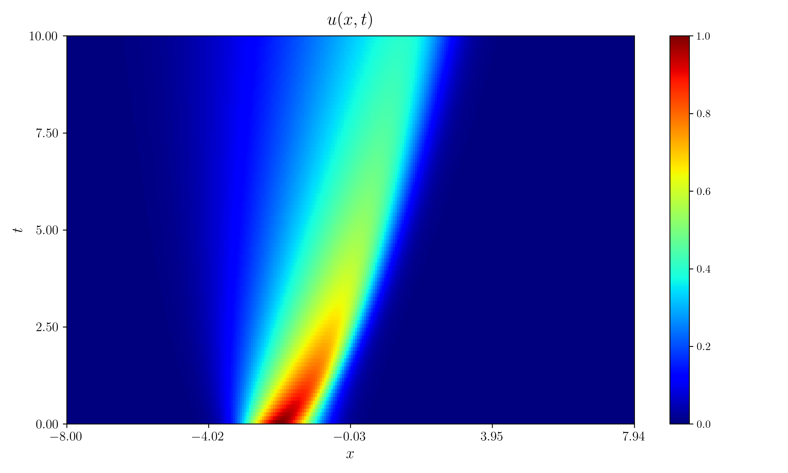
      </td>
      <td align="center">
        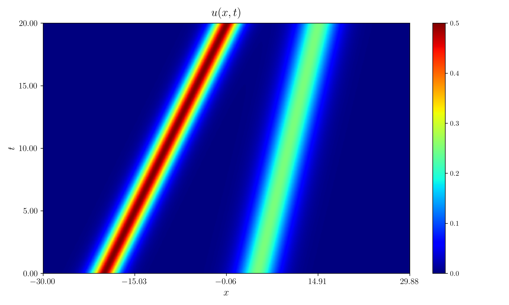
      </td>
    </tr>
    <tr>
      <td align="center">
        <strong>Mystery PDE-1</strong>
      </td>
      <td align="center">
        <strong>Mystery PDE-2</strong>
      </td>
    </tr>
  </table>

   

  <!-- Table for Mystery PDE-3 (Coupled System) Animations -->
  <table style="margin: 0 auto;">
    <tr>
      <td align="center">
        
      </td>
      <td align="center">
        
      </td>
    </tr>
    <tr>
      <td colspan="2" align="center">
        <strong>Mystery PDE-3 (Coupled System)</strong>
      </td>
    </tr>
  </table>

## Contents
1. General Framework for PDE Discovery
2. Computing Derivatives
3. Sparse Regression
4. PDE-1 Discovery
5. PDE-2 Discovery
6. PDE-3 Discovery

## General Framework for PDE Discovery

Our goal is to identify the underlying partial differential equation (PDE) from measurement data. For a 1+1D system, where the solution $u(x,t)$ is measured on a discretized spatiotemporal domain $\tilde{\Omega}$ with $n$ spatial points and $m$ time points, we first arrange the data into a vector form. Specifically, the time derivative $u_t$ is discretized into a column vector

$$
\mathbf{U}_t \in \mathbb{R}^{(n\cdot m)\times 1} =
\begin{bmatrix}
u_t(x_0,t_0) \\
u_t(x_1,t_0) \\
u_t(x_2,t_0) \\
\vdots \\
u_t(x_{n-1},t_m) \\
u_t(x_{n},t_m)
\end{bmatrix}.
$$

At the same time, we construct a feature library (or candidate matrix) $\Theta$ that consists of the measured solution $u$ and its spatial (and possibly mixed) derivatives. For example, a typical candidate library might look like

$$
\Theta =
\begin{bmatrix}
1 & u(x_0,t_0) & u_x(x_0,t_0) & u(x_0,t_0)^2 & \cdots & u^3\,u_{xxx}(x_0,t_0) \\
1 & u(x_1,t_0) & u_x(x_1,t_0) & u(x_1,t_0)^2 & \cdots & u^3\,u_{xxx}(x_1,t_0) \\
1 & u(x_2,t_0) & u_x(x_2,t_0) & u(x_2,t_0)^2 & \cdots & u^3\,u_{xxx}(x_2,t_0) \\
\vdots & \vdots & \vdots & \vdots & \ddots & \vdots \\
1 & u(x_{n-1},t_m) & u_x(x_{n-1},t_m) & u(x_{n-1},t_m)^2 & \cdots & u^3\,u_{xxx}(x_{n-1},t_m) \\
1 & u(x_{n},t_m)   & u_x(x_{n},t_m)   & u(x_{n},t_m)^2   & \cdots & u^3\,u_{xxx}(x_{n},t_m)
\end{bmatrix} \in \mathbb{R}^{(n\cdot m)\times D},
$$

where $D$ is the number of candidate functions. We assume that this library is overcomplete, meaning that the true PDE can be represented as a sparse linear combination of these candidate functions.

The PDE is then written in the linear regression form

$$
\mathbf{U}_t = \Theta\,\xi,
$$

where $\xi \in \mathbb{R}^{D \times 1}$ is a coefficient vector. By applying a sparse regression method (such as Sequential Threshold Ridge Regression, STRidge), we solve for $\xi$. Each nonzero entry $\xi_j \neq 0$ indicates that the candidate term $\Theta_j$ plays a role in the governing PDE. The recovered equation is then

$$
u_t(x,t) = \sum_{j=1}^{D} \Theta_j(x,t)\,\xi_j.
$$

For a coupled 2+1D system (File 3), the procedure is analogous but extended to two fields. The measurements for $u(x,y,t)$ and $v(x,y,t)$ are arranged such that

$$
\mathbf{U}_t \in \mathbb{R}^{(n\cdot m)\times 2} =
\begin{bmatrix}
u_t(x_0,y_0,t_0) & v_t(x_0,y_0,t_0) \\
u_t(x_1,y_0,t_0) & v_t(x_1,y_0,t_0) \\
\vdots & \vdots \\
u_t(x_n,y_m,t_M) & v_t(x_n,y_m,t_M)
\end{bmatrix}.
$$

We use the same candidate library $\Theta \in \mathbb{R}^{(n\cdot m)\times D}$ constructed from $u$, $v$, and their spatial derivatives (e.g., $u_x, u_y, v_x, v_y$, etc.). The coupled system is then represented as

$$
\mathbf{U}_t = \Theta\,\Xi,
$$

where $\Xi \in \mathbb{R}^{D\times 2}$ is a coefficient matrix. The first column of $\Xi$ corresponds to the PDE for $u_t$ and the second column to $v_t$. Thus, we have

$$
\begin{aligned}
u_t(x,y,t) &= \sum_{j=1}^{D} \Theta_j(x,y,t)\,\xi_j^{(u)}, \\
v_t(x,y,t) &= \sum_{j=1}^{D} \Theta_j(x,y,t)\,\xi_j^{(v)}.
\end{aligned}
$$

## Computing Derivatives

In our approach, both low- and high-order derivatives from the solution $u(x,t)$ (and similarly for $v(x,t)$ in coupled systems) at each observational point are estimated to ensure robust estimation from potentially noisy data. The ultimate goal is to be able to construct the feature library $\Theta$ used in our sparse regression framework for PDE discovery.

The function ``TikhonovDiff`` is employed to compute derivatives via Tikhonov regularization. Specifically, it solves the minimization problem

$$
\min_{g}\,\|Ag - f\|_2^2 + \lambda \|Dg\|_2^2,
$$

where $A$ approximates trapezoidal integration and $D$ represents a finite-difference operator. For $d>1$, the output of ``TikhonovDiff`` is further differentiated using the ``FiniteDiff`` function. The latter implements a second-order finite difference scheme; for instance, the first derivative is approximated as

$$
u'(x_i) \approx \frac{u(x_{i+1}) - u(x_{i-1})}{2\Delta x},
$$

with appropriate one-sided formulas at the boundaries, and similarly for higher-order derivatives. We assume a regularly spaced grid.

Variant functions, such as `ConvSmoother`, `PolyDiff`, and `PolyDiffPoint`, are designed to be employed for different cases depending on specific smoothing and differentiation requirements, including mainly when the data is expected to be noisy or the grid be non-uniform.

## Sparse Regression

Once the candidate library $\Theta \in \mathbb{R}^{(n\cdot m)\times D}$ is assembled from the discretized solution $u(x,t)$ and its spatial derivatives, and the temporal derivative is computed and organized into $U_t \in \mathbb{R}^{(n\cdot m)\times 1}$, the identification problem is cast as

$$
U_t = \Theta\,\xi.
$$

Because $\Theta$ is overdetermined (with $n\cdot m > D$), a standard least-squares solution would yield a dense vector $\xi$. However, we know from the underlying physics that the true PDE is parsimonious, so only a few terms are active. To promote sparsity in $\xi$, we solve the regularized problem

$$
\min_{\xi\in\mathbb{R}^{D}} \|U_t - \Theta\,\xi\|_2^2 + \lambda\,\|\xi\|_2^2,
$$

and then apply a hard threshold, setting coefficients with $|\xi_j|$ below a certain tolerance to zero. This procedure—implemented via our STRidge and TrainSTRidge functions—ensures that the final coefficient vector is sparse, with nonzero entries corresponding to the relevant terms in the PDE. In the case of coupled systems, the formulation is extended to

$$
U_t = \Theta\,\Xi,
$$

with $\Xi \in \mathbb{R}^{D\times 2}$ and each column recovered separately by sparse regression. In both cases, the sparsity of the solution is crucial: it leads to an interpretable model in which each nonzero coefficient $\xi_j$ (or $\xi_j^{(u)}$ and $\xi_j^{(v)}$ in the coupled case) directly indicates an active term in the governing equation.

---
---
---

   

## PDE-1 Discovery

For a concise summary of the experimental settings and outcomes, the following table summarizes the key parameters—including the data dimensions, linear system setup, regression hyperparameters, regression outcomes, and PDE identification metrics. 

<!-- 

| **Category**                  | **Specification (PDE-1)**                                                                                                                                               |
|-------------------------------|-----------------------------------------------------------------------------------------------------------------------------------------------------------------|
| **Data Dimensions**           | ($x,t$) = $256 \times 101$                                                                                                                               |
| **Linear System Setup**       | $D = 3$, $P = 3$, Library Size = $16$; Total Samples = $256 \times 101 = 25856$                                                                                |
| **Regression Hyperparameters**| $\lambda = 1\times10^{-5}$, Tolerance = $1\times10^{-6}$, Iterations = $10$, Train Split = $80\%$, Optimal Tolerance = $2.5\times10^{-5}$          |
| **Regression Outcomes**       | $\Theta$ shape: $(25856,\,16)$, Predicted $u_t$ shape: $(25856,\,1)$                                                                                           |
| **PDE Identification Metrics**| Avg Relative $L_2$ Error = $8.78\times10^{-3}$, MSE = $3.36\times10^{-7}$                                                                                        |

 -->

The recovered PDE is:

$$
u_t = -1.01491\, u\, u_x + 0.09949\, u_{xx}
$$

Through visual inspection of the original solution, and from the form of the identified PDE, we could identify the first system to emerge from Burgers’ equation.

The quality and accuracy of the prediction is demonstrated by both quantitative error metrics and qualitative visualizations.

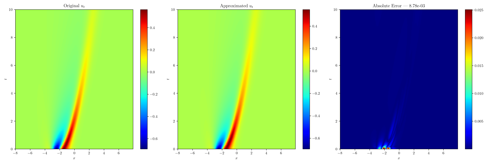

<b>Fig. 1:</b> Heatmap comparison of $u_t$ for PDE-1. The visual similarity confirms that the regression model closely approximates the observed dynamics.

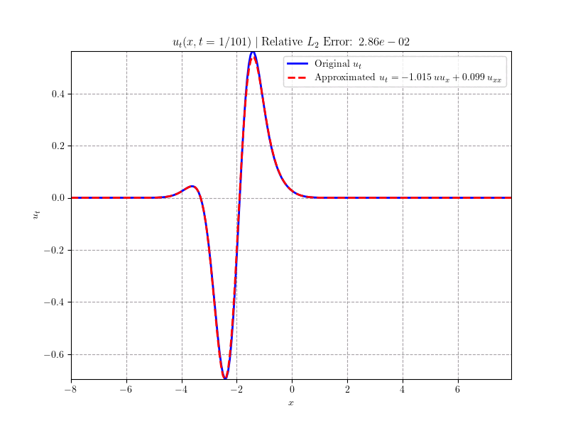

<b>Fig. 2:</b> Spatiotemporal animation comparing true and approximated $u_t$ evolution across the domain for PDE-1.

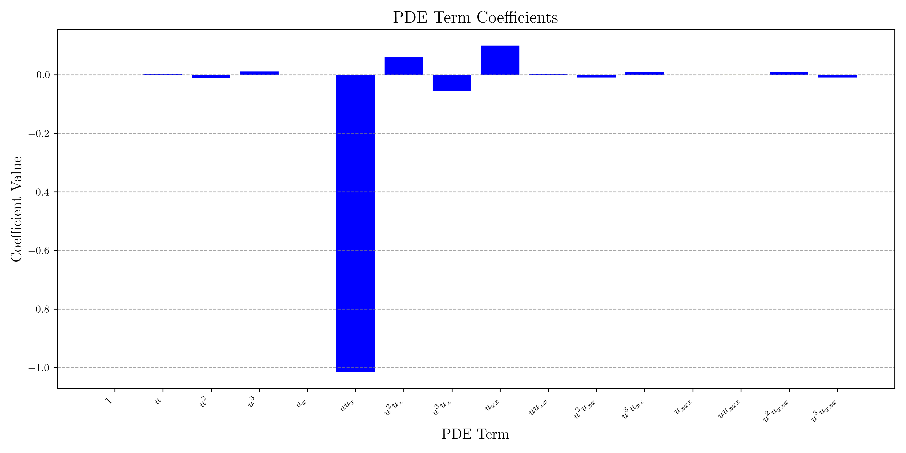

<b>Fig. 3:</b> Bar plot showing the influence (regression coefficients) of each candidate term on the dynamics for PDE-1. The plot clearly illustrates the sparse nature of the recovered coefficients

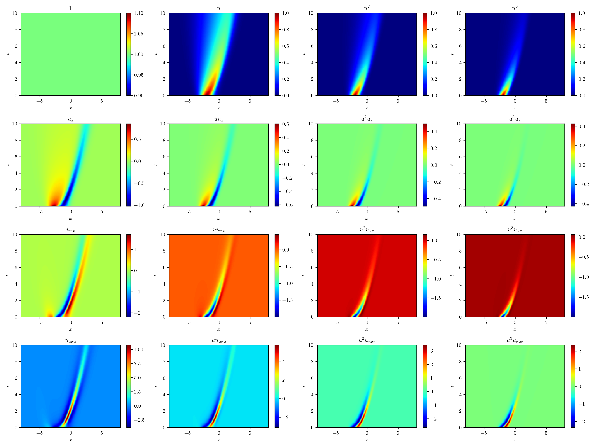

<b>Fig. 4:</b> The Candidate Library Heatmap used for recovering PDE-1.

  <table>
    <tr>
      <td align="center">
        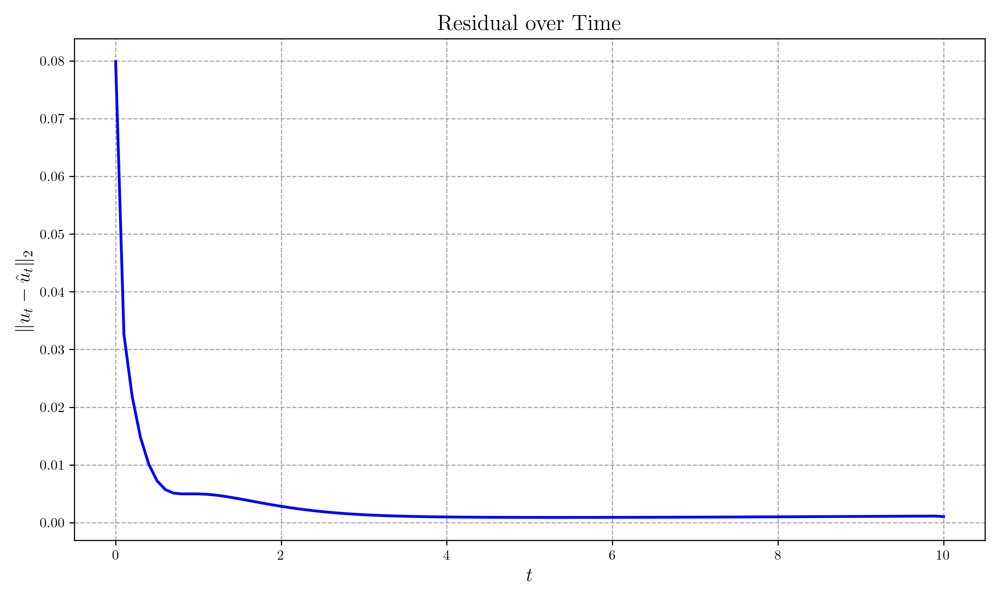
        
<b>Fig. 5:</b> Residual (the spatial $L_2$ norm of the error) over time for PDE-1. The relatively low residual values across the time domain validate the accuracy of our recovered PDE.

      </td>
      <td align="center">
        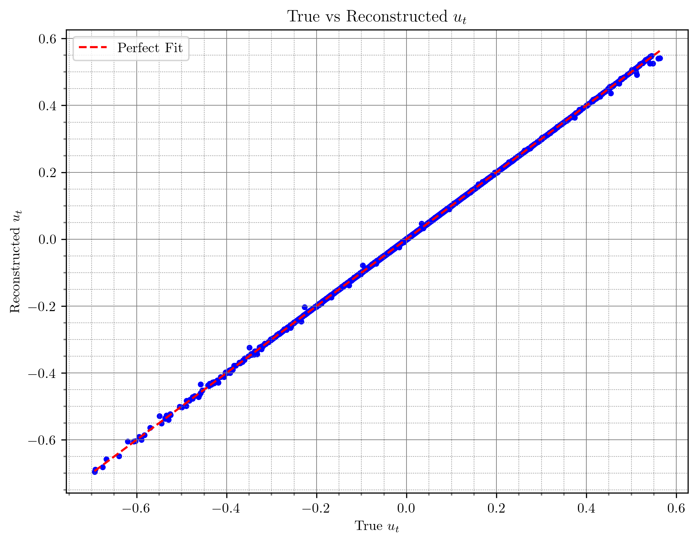
        
<b>Fig. 6:</b> Scatter plot of true vs. reconstructed $u_t$ for PDE-1. The points closely align with the perfect fit line, indicating a strong correlation. 

      </td>
    </tr>
  </table>

The scatter plot compares the true ($u_t$) (computed from the observed ($u(x,t)$)) with the reconstructed $u_t$ obtained from the identified PDE. Each point represents a measurement (a spatial–temporal location) where the x-coordinate is the true value and the y-coordinate is the predicted value. The red dashed line represents the "perfect fit" (i.e. (y=x)); if the model were perfect, all points would lie exactly on that line. Clustering of points near the line indicates that the model is accurately capturing the time derivative, whereas systematic deviations would signal discrepancies between the observed and reconstructed dynamics.

## PDE-2 Discovery

We followed the same workflow for recovering PDE-2. For a concise summary of the experimental settings and outcomes, the following table summarizes the key parameters.

<!-- 

| **Category**                  | **Specification (PDE-2)**                                                                                                                                               |
|-------------------------------|-----------------------------------------------------------------------------------------------------------------------------------------------------------------|
| **Data Dimensions**           | ($x,t$) = $512 \times 201$                                                                                                                               |
| **Linear System Setup**       | $D = 3$, $P = 1$, Library Size = $8$; Total Samples = $512 \times 201 = 102912$                                                                                 |
| **Regression Hyperparameters**| $\lambda = 1\times10^{-5}$, Tolerance = $1\times10^{-4}$, Iterations = $10$, Train Split = $80\%$, Optimal Tolerance = $0$                         |
| **Regression Outcomes**       | $\Theta$ shape: $(102912,\,8)$, Predicted $u_t$ shape: $(102912,\,1)$                                                                                          |
| **PDE Identification Metrics**| Avg Relative $L_2$ Error = $5.45\times10^{-2}$, MSE = $6.89\times10^{-6}$                                                                                        |

 -->

The recovered equation for PDE-2 is:

$$
u_t = -5.56656\, u\, u_x - 0.88657\, u_{xxx} - 0.10044\, u\, u_{xxx}
$$

Through visual inspection of the original solution, and from the form of the identified PDE, we could identify the first system to emerge from the Korteweg–De Vries equation (KdV equation) equation.

The quality and accuracy of the prediction is demonstrated by both quantitative error metrics and qualitative visualizations.

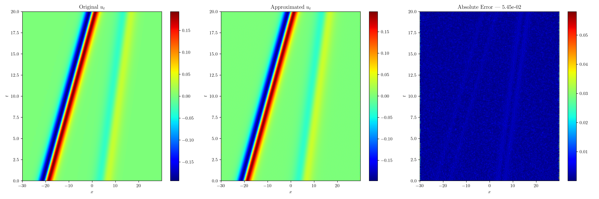

<b>Fig. 1:</b> Heatmap comparison of $u_t$ for PDE-2.

<b>Fig. 2:</b> Spatiotemporal animation comparing true and approximated $u_t$ for PDE-2.

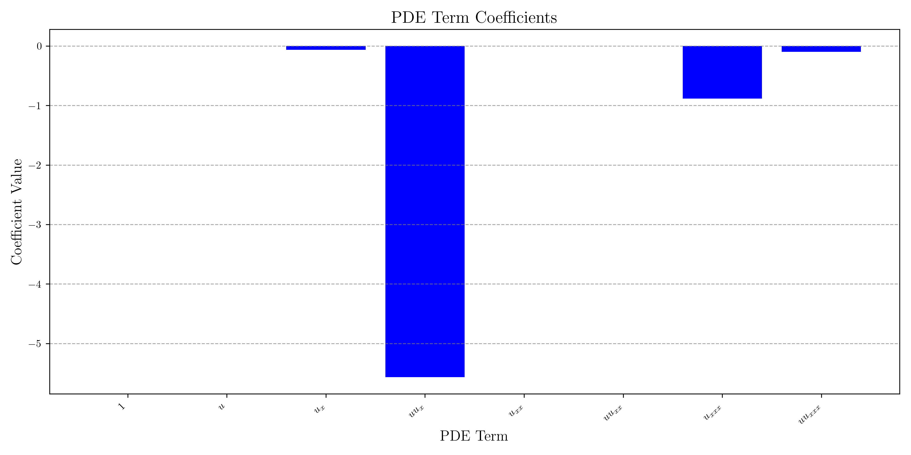

<b>Fig. 3:</b> Approximated PDE terms for PDE-2.

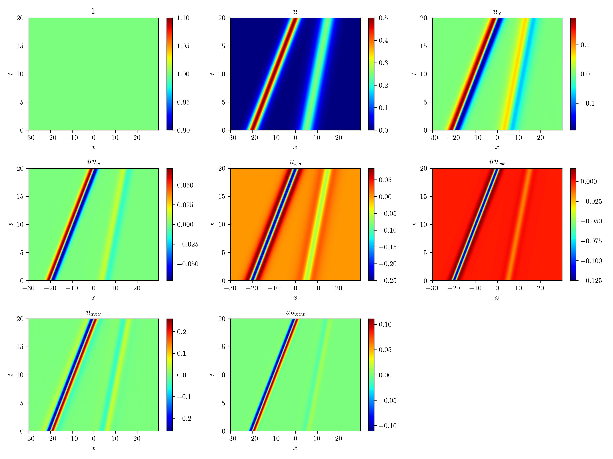

<b>Fig. 4:</b> Candidate terms for PDE-2.

  <table>
    <tr>
      <td align="center">
        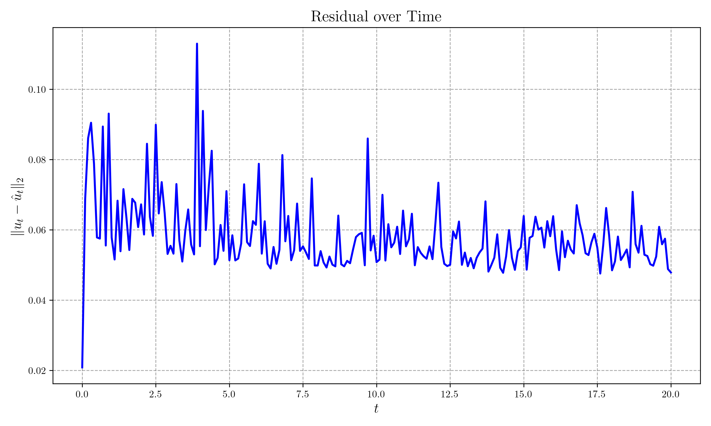
        
<b>Fig. 5:</b> Residual over time for PDE-2.

      </td>
      <td align="center">
        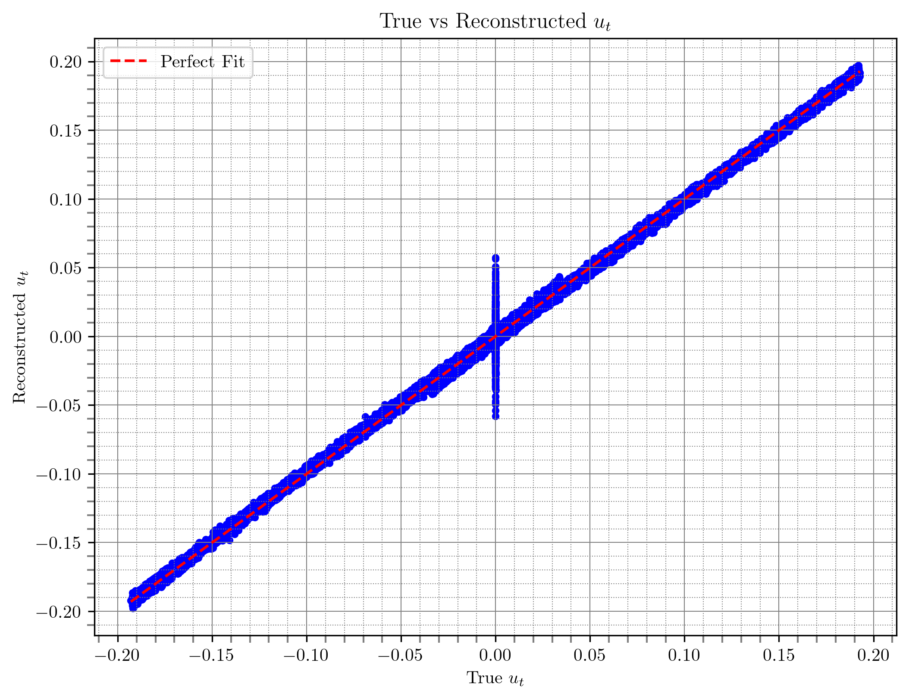
        
<b>Fig. 6:</b> Scatter plot of true vs. reconstructed $u_t$ for PDE-2. 

      </td>
    </tr>
  </table>

## PDE-3 Discovery

Due to the large dataset (≈13 million samples), we downsample before constructing the candidate matrix. By selecting every 4th point in each dimension, the sample count reduces by a factor of \(4^3=64\), lowering the total to roughly 205,000 samples. This speeds up regression while retaining key features.

The `downsample_3d` function extracts every \(ds\_factor\)-th point, and new grid spacings (\(dx\), \(dy\), \(dt\)) are recalculated accordingly. The downsampled, optionally normalized, fields are then used in a modified `build_linear_system_2D` to generate a smaller candidate matrix \(\Theta\) and time derivative matrix \(U_t\). Sparse regression on this reduced system yields a coefficient matrix \(\Xi\), efficiently predicting the governing PDE. Although downsampling reduces resolution, it captures the overall dynamics when the system is sufficiently smooth.

For a concise summary of the experimental settings and outcomes, the following table summarizes key parameters used.

<!-- 

| **Category**                  | **Specification (PDE-3 -- Downsampled)**                                                                                                                                               |
|-------------------------------|-----------------------------------------------------------------------------------------------------------------------------------------------------------------|
| **Data Dimensions**           | ($x,y,t$) = $64 \times 64 \times 51$                                                                                                                     |
| **Linear System Setup**       | $D = 3$, $P = 3$, Library Size = $10$; Total Samples = $64 \times 64 \times 51 = 208896$                                                                          |
| **Regression Hyperparameters**| $\lambda = 1\times10^{-5}$, Tolerance = $1\times10^{-5}$, Iterations = $10$, Train Split = $80\%$                                                       |
| **Regression Outcomes**       | $\Theta$ shape: $(208896,\,10)$, Predicted $(U_t,V_t)$ shape: $(208896,\,2)$                                                                                    |
| **PDE Identification Metrics**| For $u_t$: Avg Relative $L_2$ Error = $1.50\times10^{-1}$, MSE = $8.06\times10^{-3}$; For $v_t$: Avg Relative $L_2$ Error = $1.51\times10^{-1}$, MSE = $8.11\times10^{-3}$ |

 -->

The recovered coupled system of governing PDEs:
$$
u_t = 0.88532\, v
$$

$$
v_t = -0.88544\, u
$$

Through visual inspection of the original solution, and from the form of the identified PDE, we could identify the first system to depict a reaction-diffusion process.

As in PDE-1 and PDE-2 discovery, the quality and accuracy of the prediction is demonstrated by both quantitative error metrics and qualitative visualizations.

  <table>
    <tr>
      <td align="center">
        
        
<b>Fig. 1a:</b> Overall animation of \(u_t\) for PDE-3.

      </td>
    </tr>
    <tr>
      <td align="center">
        
        
<b>Fig. 1b:</b> Overall animation of \(v_t\) for PDE-3.

      </td>
    </tr>
  </table>

  <table>
    <tr>
      <td align="center">
        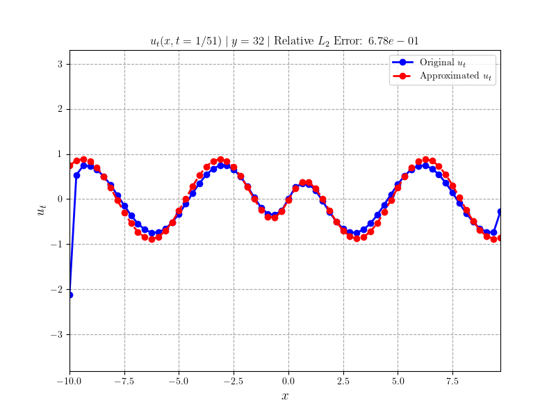
        
<b>Fig. 2a:</b> Animation of $u_t$ (fixed y-slice) for PDE-3.

      </td>
      <td align="center">
        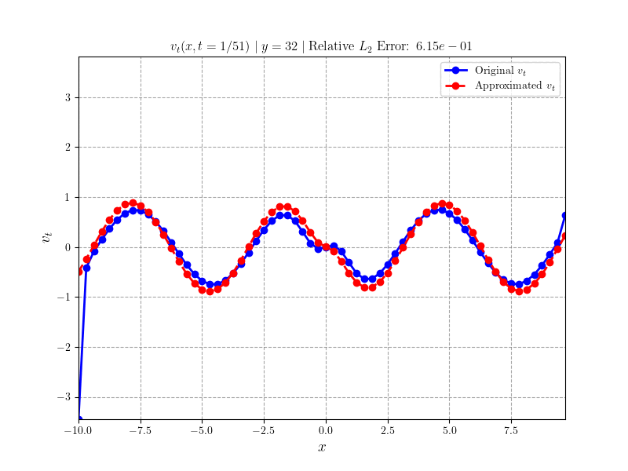
        
<b>Fig. 2b:</b> Animation of $v_t$ (fixed y-slice) for PDE-3.

      </td>
    </tr>
  </table>

  <table>
    <tr>
      <td align="center">
        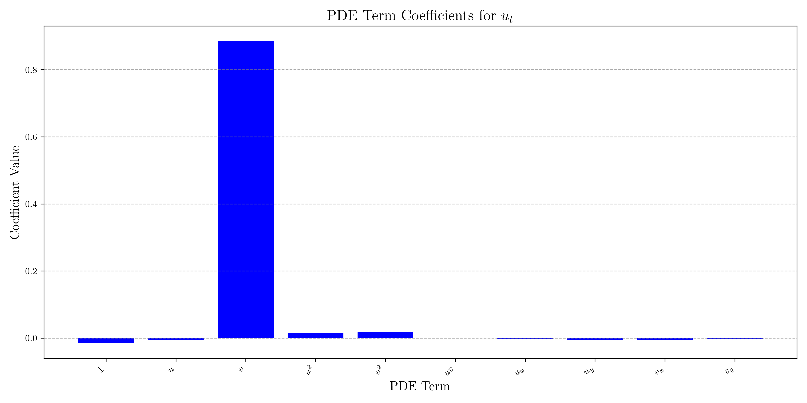
        
<b>Fig. 3a:</b> Approximated PDE terms for $u_t$ (PDE-3).

      </td>
      <td align="center">
        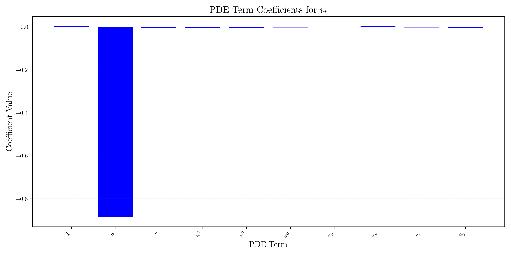
        
<b>Fig. 3b:</b> Approximated PDE terms for $v_t$ (PDE-3).

      </td>
    </tr>
  </table>

  <table>
    <tr>
      <td align="center">
        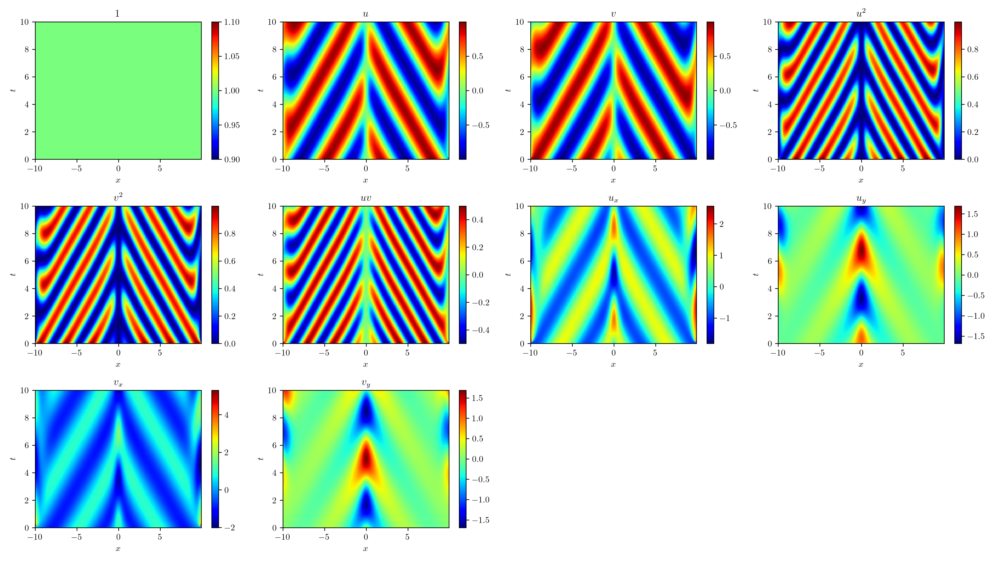
        
<b>Fig. 4a:</b> Candidate terms for PDE-3 (full data).

      </td>
      <td align="center">
        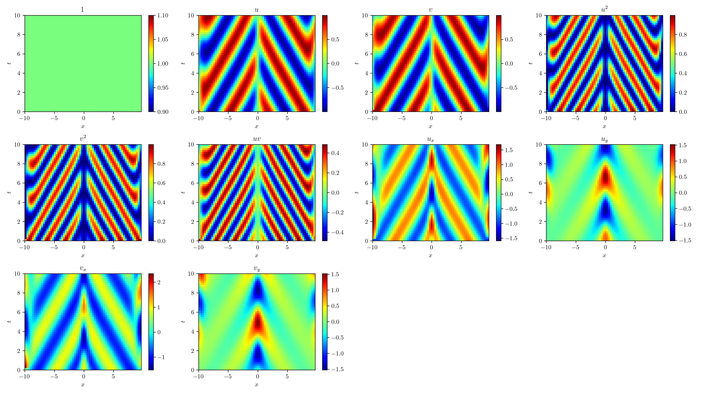
        
<b>Fig. 4b:</b> Candidate terms for PDE-3 (downsampled).

      </td>
    </tr>
    <tr>
      <td colspan="2" align="center">
        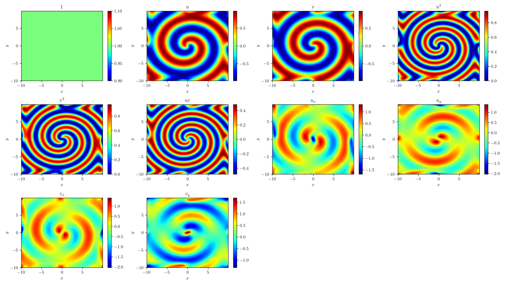
        
<b>Fig. 4c:</b> Spatial candidate terms for PDE-3 (full data, fixed time slice).

      </td>
    </tr>
  </table>

  <table>
    <tr>
      <td align="center">
        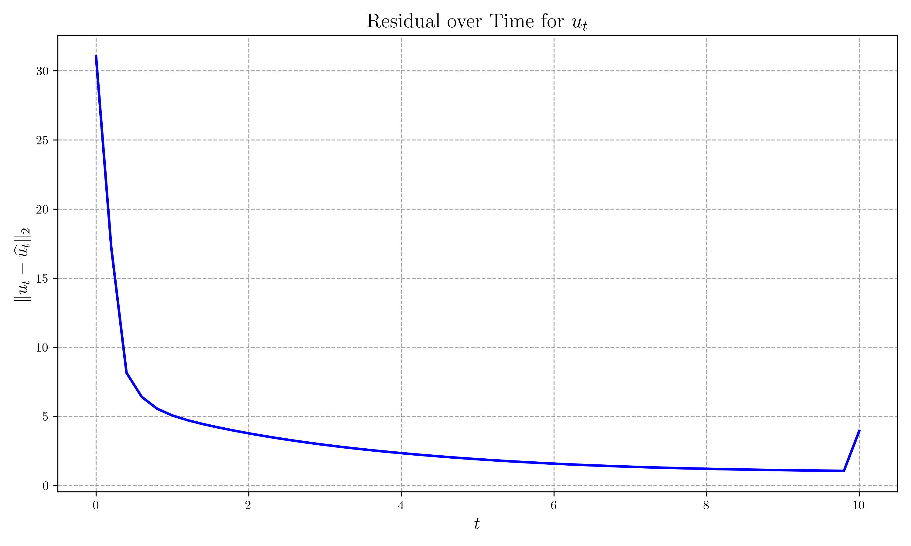
        
<b>Fig. 5a:</b> Residual over time for $u_t$ (PDE-3).

      </td>
      <td align="center">
        
        
<b>Fig. 5b:</b> Residual over time for $v_t$ (PDE-3).

      </td>
    </tr>
  </table>

  <table>
    <tr>
      <td align="center">
        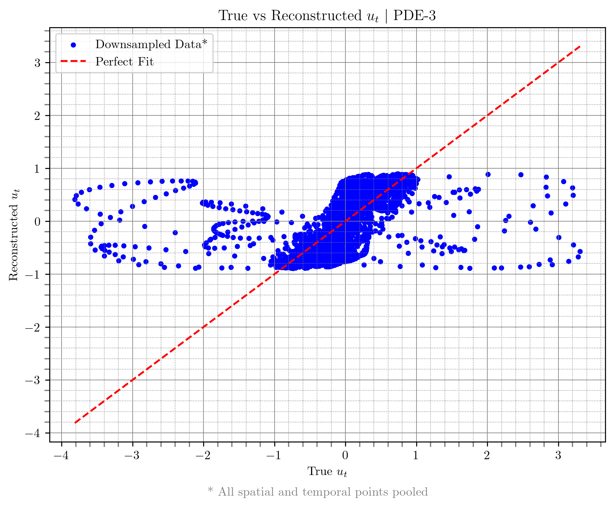
        
<b>Fig. 6a:</b> Scatter plot for $u_t$ (PDE-3). <i></i>

      </td>
      <td align="center">
        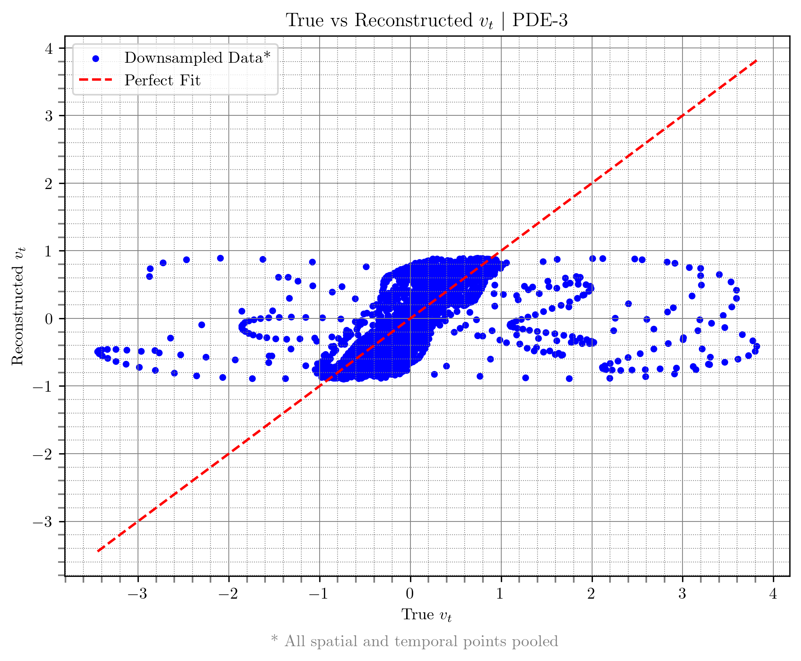
        
<b>Fig. 6b:</b> Scatter plot for $v_t$ (PDE-3). <i></i>

      </td>
    </tr>
  </table>

## Resources

[**[1]**](https://arxiv.org/pdf/1509.03580) Brunton, Steven L., Joshua L. Proctor, and J. Nathan Kutz. "**Discovering governing equations from data by sparse identification of nonlinear dynamical systems.**" Proceedings of the national academy of sciences 113.15 (2016): 3932-3937.   

[**[2]**](https://arxiv.org/pdf/2111.08481) Kaptanoglu, A. A., de Silva, B. M., Fasel, U., Kaheman, K., Goldschmidt, A. J., Callaham, J. L., ... & Brunton, S. L. (2021). **PySINDy: A comprehensive Python package for robust sparse system identification.** arXiv preprint arXiv:2111.08481.   

[**[3]**](https://arxiv.org/pdf/1609.06401) Rudy, S. H., Brunton, S. L., Proctor, J. L., & Kutz, J. N. (2017). **Data-driven discovery of partial differential equations.** Science advances, 3(4), e1602614.   

[**[4]**](https://book.sciml.ai/) **Parallel Computing and Scientific Machine Learning (SciML): Methods and Applications**

